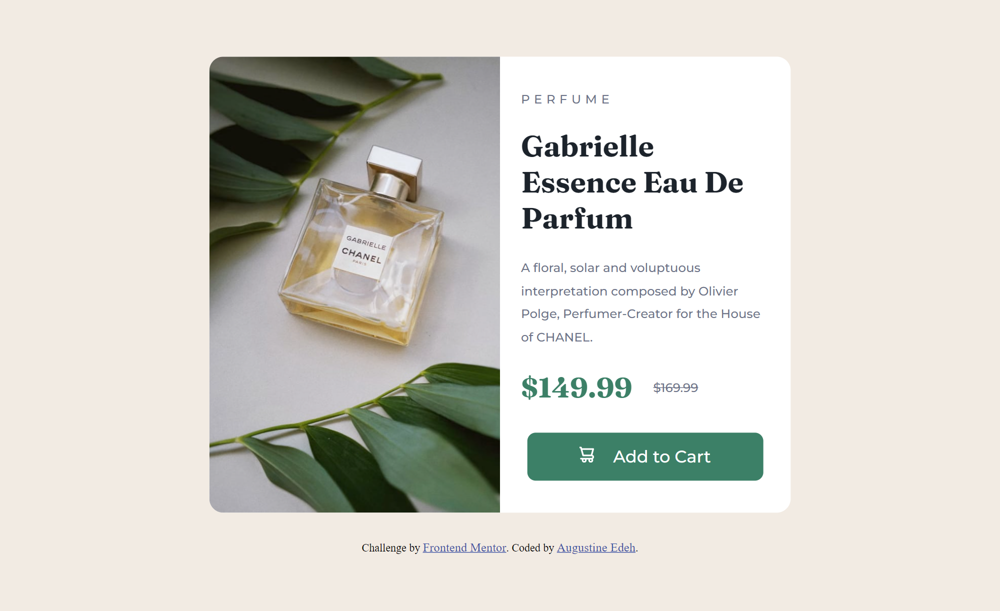

# Frontend Mentor - Product preview card component solution

# **Wecolme 👋**

This is a solution to the [Product preview card component challenge on Frontend Mentor](https://www.frontendmentor.io/challenges/product-preview-card-component-GO7UmttRfa). Frontend Mentor challenges help you improve your coding skills by building realistic projects.

## Table of contents

- [Frontend Mentor - Product preview card component solution](#frontend-mentor---product-preview-card-component-solution)
- [**Wecolme 👋**](#wecolme-)
  - [Table of contents](#table-of-contents)
  - [Overview](#overview)
    - [The challenge](#the-challenge)
    - [Screenshot](#screenshot)
      - [(Desktop View)](#desktop-view)
      - [(Mobile View)](#mobile-view)
    - [**Links**](#links)
  - [**My process**](#my-process)
    - [Built with](#built-with)
    - [What I learned](#what-i-learned)
  - [**Continued development**](#continued-development)
    - [~ Plans for continued development:](#-plans-for-continued-development)
    - [Useful resources](#useful-resources)
  - [**Author**](#author)
  - [**Acknowledgments**](#acknowledgments)

## Overview

### The challenge

Users should be able to:

- View the optimal layout depending on their device's screen size
- See hover and focus states for interactive elements

### Screenshot

#### (Desktop View)



#### (Mobile View)


### **Links**

- Solution URL: [Go to gitHub solution Repository](https://github.com/Augustine-edeh/QR-code-component--FrontEndMentor.io-challenge--)
- Live Site URL: [View live site](https://augustine-edeh.github.io/QR-code-component--FrontEndMentor.io-challenge--/)

## **My process**

### Built with

- Semantic HTML5 markup
- CSS custom properties
- CSS custom Styles
- CSS Flex layout
- Mobile-first workflow

### What I learned

- I learnt how images can be displayed without the use of the HTML

```html

```

but as an alternative use the CSS

```css
background-image: url(".image/file/path");
```

property-value pair.

- I implemented the concept of Mobile-first design workflow as I had learnt in the previous challenge before this one.
- Reinforced my knowledge of CSS Media queries, where I implemented the responsive feature for the desktop view layout of this project.

**Below is an excerpt of the CSS media query code/syntax I used in implementing the said responsive feature of this project:**

```css
@media (min-width: 1000px) {
}
```

## **Continued development**

### ~ Plans for continued development:

I hope to in the future, focus and refine my skills in the front-end development stack and also master the concepts of responsive designs, concepts of semantics in HTML as well as accessibility and other key concepts/knowledge required in becoming a world class front-end developer!

### Useful resources

- [MDN Media queries Documentation](https://developer.mozilla.org/en-US/docs/Learn/CSS/CSS_layout/Media_queries) - This is an amazing article which helped me finally understand **CSS Media queries**. I'd recommend it to anyone still learning this concept.

## **Author**

- Portfolio - [Go to my portfolio](https://augustine-edeh.github.io/My-Portfolio/)
- GitHub - [@Augustine-edeh](https://github.com/Augustine-edeh)
- Twitter - [@Augustine_edeh](https://twitter.com/Augustine_edeh)
- LinkedIn - [@Augustine Edeh](https://www.linkedin.com/in/augustine-edeh/)
- Frontend Mentor - [@Augustine-source](https://www.frontendmentor.io/profile/Augustine-source)
- Codewars - [@Augustine_edeh](https://www.codewars.com/users/Augustine_edeh)

## **Acknowledgments**

I'm seizing this opportunity to acknowledge Myself (Augustine Edeh) for completing this project and continuing to improve my experience and skills in frontend development. Thank you for the perseverance. I will one day look back at the journey and thank myself for not giving up and following my dreams above all.🚀

\- Augustine Edeh -S.

(23th January, 2023)
